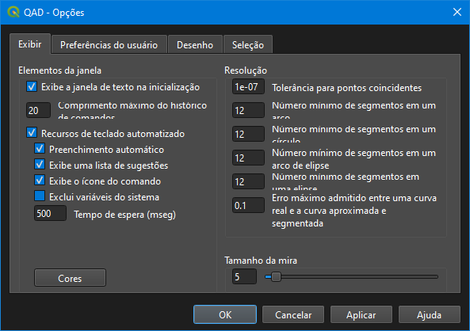
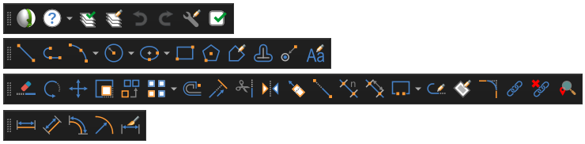
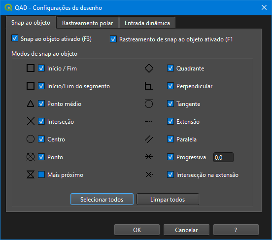
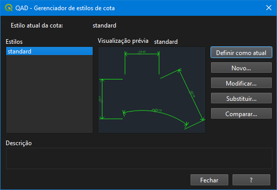

# QAD (Quantum Aided Design)

**Quantum Aided Design** is a plugin for QGIS that brings professional CAD-like commands and workflows directly into your GIS environment. It is designed to bridge the gap between traditional vector editing and advanced CAD drafting, allowing users to create, modify, and dimension geometries with high precision.

## Features

- **CAD Commands**: Full suite of drawing and editing tools (Line, Circle, Arc, Polyline, Rectangle, Polygon, Fillet, Trim, Extend, Offset, Mirror, Copy, Move, Rotate, Scale, etc.).
- **Snapping & Object Tracking**: Advanced snap modes (Endpoint, Midpoint, Center, Intersection, Tangent, Perpendicular, Quadrant, Extension, Parallel, and more) with customizable visual markers and dynamic input.
- **Dimensioning**: Create professional linear, aligned, radial, angular, and arc dimensions with full control over style, text, symbols, and layers.
- **Text & Annotation**: Insert dynamic text with support for rotation and height driven by layer fields.
- **Customization**: 
  - Configure commands and shortcuts via `.pgp` files.
  - Set system variables for precise control (e.g., `OSMODE`, `CURSORSIZE`, `AUTOSNAP`).
  - Adjust tolerance and segment counts for arc/circle approximation.
- **Layer Management**: Works with QGIS vector layers, distinguishing between symbol layers and text layers, with support for field-driven rotation, scale, and size.

## Developers

- **gam17** (Developer, UI, Documentation)
- **em-rezende** (Complete rewrite of the code for QGIS 4.0 (written by Ezequiel M. Rezende) - fork of gam17 code)

## Contributors

- **Aitor Gil** (jaitor1) - Tester
- **Gabriel De Luca** - Tester
- **Tony Shepherd** - Tester

## Installation

1. Download the plugin from the [QAD GitHub Repository](https://github.com/em-rezende/QAD).
2. Place the plugin folder in your QGIS Python plugins directory.
3. Enable the plugin in QGIS via **Plugins -> Manage and Install Plugins**.
4. The QAD toolbar and menu will appear in your QGIS interface.

## Work Philosophy

QAD adopts a logic closer to popular CAD software (like AutoCAD) to reduce learning time. It assumes the user has basic knowledge of CAD commands, focusing on the visual and spatial context of QGIS.

**Important**: The project's coordinate reference system (CRS) must be a **projected** CRS, not a geographic one, to ensure accurate distances and dimensions.

### Layer Models

QAD manages QGIS layers by distinguishing them into two types:

1.  **Symbol Layers**: Used to display symbols (points). Supports optional fields for rotation and scale.
2.  **Text Layers**: Used for labels and text (points). Requires a character field for text content, and optional fields for height and rotation.

#### Setting up a Text Layer:
- The layer must be a Point layer.
- The symbol must have at least 90% transparency.
- Labels must be configured to read font size and rotation from specified fields.

#### Setting up a Symbol Layer:
- Use "Single Symbol" symbology.
- Enable "Map units" for size.
- Configure rotation using an expression (e.g., `360 - "rotation_field"`).

## Dimensioning

QAD stores dimensions across three different layers (Text, Symbol, and Linear). Each layer type has specific field requirements to fully support editing and grouping.

- **Text Layer**: Stores the dimension text, font, height, rotation, and a unique ID (for PostGIS).
- **Symbol Layer**: Stores arrows and markers (e.g., "B1", "B2", "LB").
- **Linear Layer**: Stores dimension lines and extension lines (e.g., "D1", "X1").

Dimension styles are saved in `.dim` files which are loaded at startup or when a project is loaded.

## The Interface

### Options Panel
Configure program settings, including command history, autocomplete, snap settings, and tolerance for curves.

### Toolbars
Quick access to all drawing, editing, dimensioning, and snapping tools.

### Snap Configuration
Fine-tune your object snap modes (OSNAP) and dynamic input settings.

### Dimension Style Manager
Create, modify, and compare dimension styles.

## Command Customization

You can customize command shortcuts by creating a file named `qad_<language>_<region>.pgp` (UTF-8). The file is searched in the paths defined by the system variable `SUPPORTPATH`. Commands can be called in English by prefixing them with an underscore (e.g., `_LINE`).

## System Variables

QAD uses system variables to control behavior. These can be of type integer, real, char, bool, or RGB color.

- **Global Variables**: Saved in `QAD.INI` (e.g., `APBOX`, `CURSORSIZE`, `OSMODE`).
- **Project Variables**: Saved in `<current project name>_QAD.INI` (e.g., `ARCIMINSEGMENTQTY`, `FILLETRAD`, `ORTHOMODE`).

### Key Variables:
- `ARCIMINSEGMENTQTY` / `CIRCLEMINSEGMENTQTY`: Minimum number of segments for approximating arcs/circles.
- `CURSORCOLOR`: RGB color for the crosshair pointer.
- `DYNDIGRIP`: Controls dynamic input dimensions.
- `OSPROGRIDSTANCE`: Progressive distance for snap mode.

## Manual

For a complete list of commands (e.g., `ARC`, `ARRAY`, `BREAK`, `DIMLINEAR`, `EXPLODE`, `INSERT`, `TEXT`, `PLINE`, etc.) and detailed workflow guides, please refer to the [QAD Manual](https://github.com/em-rezende/QAD.github.io).

## License

This plugin is distributed under the terms of the GNU General Public License.

## Support & Feedback

For bug reports, feature requests, or general support, please visit the [QAD GitHub Issues Page](https://github.com/em-rezende/QAD/issues).

---

**Current Version:** 4.0.0  
**QGIS Compatibility:** Minimum 4.0, Maximum 4.99  
**Repository:** [https://github.com/em-rezende/QAD_Plugin_QGIS_4.0](https://github.com/em-rezende/QAD_Plugin_QGIS_4.0)
